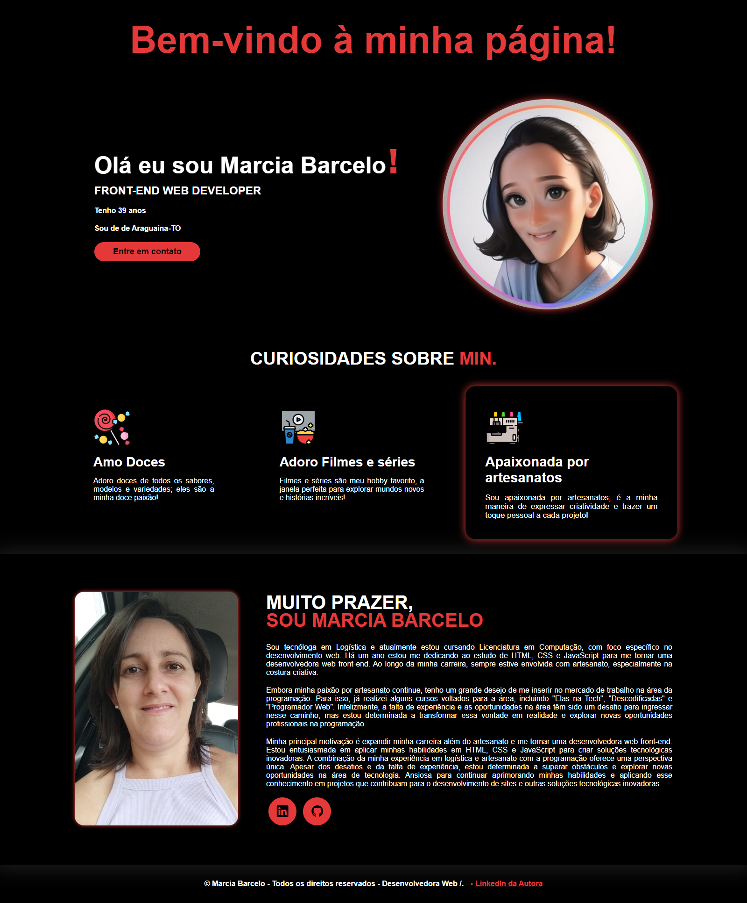

# Minha Página - Front-End Jr




## Descrição

Esta é uma página web de apresentação desenvolvida como parte da Trilha Inicial Front-End Jr. O objetivo é criar um site pessoal que destaque minhas habilidades e interesses, utilizando HTML, CSS e JavaScript.

## Estrutura do Projeto

- **HTML**: Estrutura básica da página, incluindo cabeçalho, seções e rodapé.
- **CSS**: Estilos aplicados para tornar a página visualmente atraente e responsiva.
- **Imagens**: Inclui várias imagens utilizadas na página.

## Arquivos

- `index.html`: Arquivo principal HTML da página.
- `styles.css`: Arquivo CSS contendo todos os estilos aplicados à página.

## Recursos Utilizados

- **Bootstrap Icons**: Biblioteca de ícones utilizada para adicionar ícones ao site.
- **Animações CSS**: Inclui animações para efeitos visuais, como o efeito de digitação no cabeçalho e animações de flutuação nas imagens.

## Seções da Página

1. **Cabeçalho**:
   - Saudações e boas-vindas.
   - Botão para contato via WhatsApp.

2. **Topo do Site**:
   - Apresentação pessoal com informações básicas.
   - Imagem de avatar.

3. **Curiosidades**:
   - Seção destacando interesses e paixões, como doces, filmes e artesanato.

4. **Sobre**:
   - Detalhes sobre a experiência e motivação profissional.
   - Links para perfis no LinkedIn e GitHub.

5. **Rodapé**:
   - Informações de direitos autorais e link para o LinkedIn da autora.

## Instruções de Uso

1. **Clone o Repositório**:
   ```bash
   git clone <URL do repositório>

** Obrigada por visitar esse repositório!

